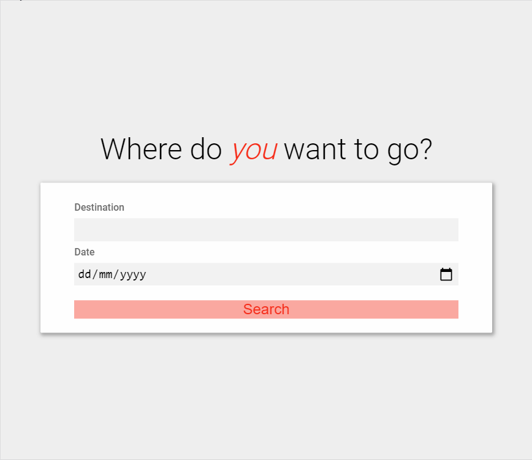
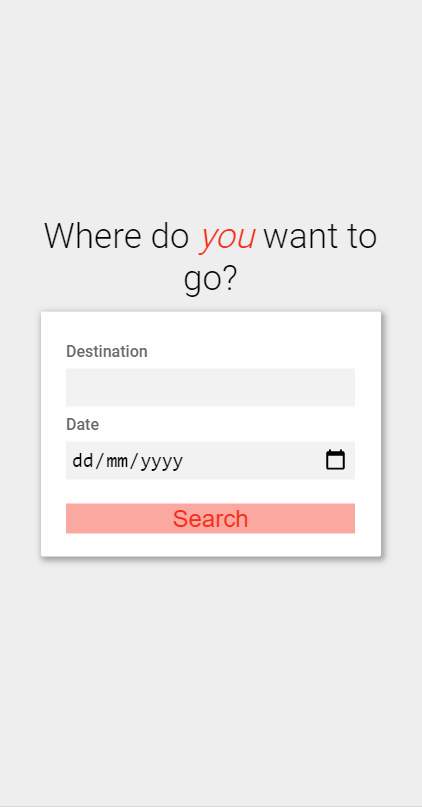

# Travel Planner Web Application


_Travel Planner Web Application in operation_

## Deployment
The app has been deployed to heroku and is available [here](https://guarded-tundra-65840.herokuapp.com/).

## Description
Full stack application with a responsive and dynamic UI that allows a user to plan a multi destination trip displaying an image and weather data for each location on that trip. The app, built in Html, Sass and Javascript on the front end uses a nodejs backend which utilises three third party APIs to retrieve the data for each trip. 

## Installation

1. Ensure that npm and node are installed on your system. This project was developed with node v14.15.4 and npm 6.14.10.
2. Clone and download the project from GitHub. 
3. Install all the project dependencies
   ```npm install```
4. The project uses 3 external APIs for its functionality, to use these services you need to sign up to them.
   - [geonames](http://www.geonames.org/) needs a validate username to use its API
   - [weather bit](https://www.weatherbit.io/api) requires a free daily forecast account to obtain an API key
   - [Pixabay](https://pixabay.com/api/docs/) necessitates a free account to get an API key
  
   Once signed up to these services, create a file called .env in the root directory and copy the code below into the file, entering your own details instead of the question marks. 
      ```
      GEONAME_USERNAME = '???'
      WEATHERBIT_API_KEY = '???'
      PIXELBAY_API_KEY = '???'
      ```

## Building and running the application

The front end application is built with Webpack and has two configurations a development build and a production build. 

- To build the development configuration use ```npm run build-dev```
- To build the production configuration use ```npm run build-prod```

```npm run start```

Load a browser and access the web app at [http://localhost:8000/](http://localhost:8000/) to run the application.

## Usage
The purpose of the application is for users to build a travel plan for a trip they would like to take. The user can search for destinations they are interested in and specify a date when they would like to visit that destination. This search will return data that is displayed in a results card with an image of the location and it weather forecast. _Note if the trip is starting more than 16 days in the future the weather forecast displayed will be for 16 days time as that is the last forecast available_. 

If the user likes that destination they can then add it to their travel plan by clicking the add button on the results card. This will automatically take the user to the 'my travel plan' section of the webpage where their current trip destinations are diplayed in individuals cards in a grid layout. If they user wishes to add another trip they can click on the 'Add New Trip' card in the my travel plan section which will take the user back to the form section of the site to search for a new destination. A user can also delete a trip by clicking the 'remove trip' button on current 'my travel plan' cards.

### Dependencies
The project was developed with node v14.15.4. All dependencies listed in the package.json file.

## Overview 
The Travel Planner Web Application uses a full stack solution. The front end is designed with Html, Sass and js. The backend is written in js using the Nodejs javascript runtime and the Express framework. It uses webpack for configuring the front end build process. 

### Front End 
 The front end is a responsive design that works from small mobile devices to large desktop displays. The UI was designed to be attention grabbing and dynamic, implementing the following features: 

- A full screen hero banner with an animated header and flashing call to action button which greets the user when the page is first loaded
- Automatic scrolling of the page when certain events occur
- Form animations when form results are returned 


_Examples of animations on the front end UI on a tablet screen size_

The webpage form provides **validation** of the data input. It checks if the date entered is in the future and that the place name entered doesnt contain unexpected characters or numbers. 

When the user searches for a new destination and date using the form the front end will send an API POST call to the local server's endpoint '/query', if the response has a status of failure, the front end displays an error, if the response has a status of complete then the front end parses the results and displays it in a result card in the form section of the webpage. 

### Backend
The backend uses an Express server to serve the front end page it also has the end point '/query' that the front end sends its search requests too. When a POST request is sent to the '/query' endpoint the flow of events on the Express server are as follows:

- The place name and the date is parsed in to variables from the request body object
- The numbers of days from the current date to the date sent are calculated 
- A response object is created and the number of days is added to it
- A POST request to the geoname API is made which includes the place name in it
- The geoname API responses with the coordinates for that location, as well as the country. The place name and county are saved to the response object.
- The coordinates are used to make a GET request to the Weather Bit forecast API that responses with the forecast for the next 16 days. The date sent to the '/query' endpoint is used to pick the correct forecast _note if date is over 16 days away the forecast for the 16th day is used_ This forecast is saved to the response object.
- The place name and country are used to make a GET request to the pixabay API to get images of the location, the url of the first image detailed in the returned result array is saved to the response object
- If no images are returned, normally because the location is obscure, then another GET request is sent to the pixabay API with just the location's country, the url of the first image detailed in the returned result array is saved to the response object
- The response object is then sent to the front end with a status property of complete
- If there is an error in any of these steps the server will send a repsonse to the front end with the status failure and a message detailing the error

The backend server code uses promises and 'then' chains to achieve this asynchronous behaviour. 

## Error Handling
The user may encounter several errors. These can be
- Local errors, the form identifies data validation issues when the user enters incorrect data
- Remote errors, when the Express server is processing the front ends post to the '/query' endpoint, in an unlikely event an error may occur resulting in a response to the front end with a status of failure and a message detailing the cause of it

When an error occurs a pop up message box appears over the form section of the webpage, detailing the error that has happen.



_Examples of an error message on the front end UI on a mobile screen size_

## Testing with Jest
The Jest testing framework was used to run some basic tests on the server and the front end. 

For the front end a jest test was written to test the place name validation function ```isValidationPlaceName```, for the backend a simple test to determine if the app function existed in the server.js file was run. 

## Service Workers
Service workers were included in the production environment for the application. 
